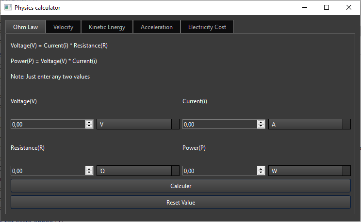

# Calculatrice Physique QT

## 🧪 À propos
Ce projet QT, réalisé en C++, est une calculatrice dédiée aux principes physiques. Elle permet de calculer des valeurs clés telles que la loi d'Ohm, la vitesse, l'énergie cinétique, l'accélération et le coût de l'électricité, tout en prenant en compte les différentes unités.

## 📚 Prérequis
- QT (C++)
- Manipulation de chaînes
- Boucle / Condition
- Formules physiques

## 🛠️ Outils et Fonctionnalités
- **Loi d'Ohm**
- **Vitesse**
- **Énergie cinétique**
- **Accélération**
- **Coût de l'électricité**

## 📸 Capture d'écran

## 🔗 Références
- [Calculatrice en ligne de physique](https://calculator-online.net/physics/)
- [Formules de physique](https://physicscalc.com/physics-formulas/)

---

👨‍💻 Développé avec passion dans le cadre du Travaux Pratiques 2
